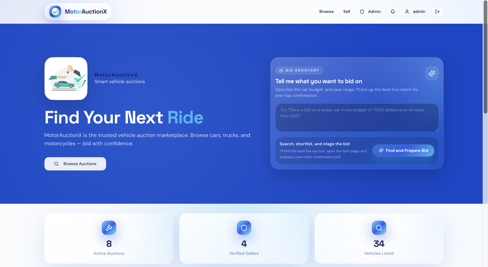
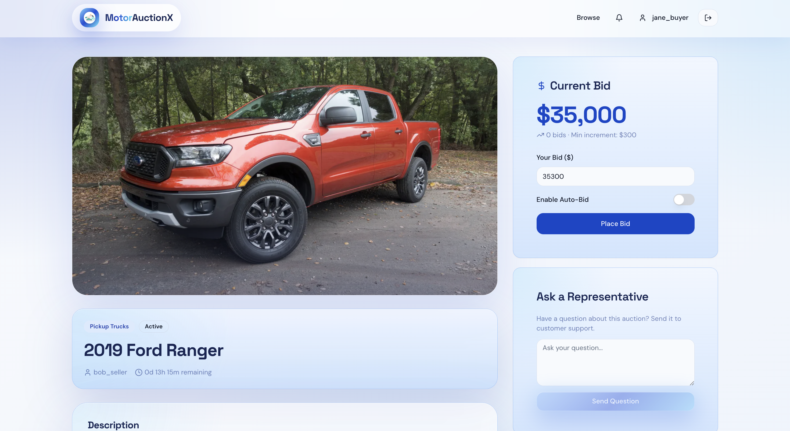
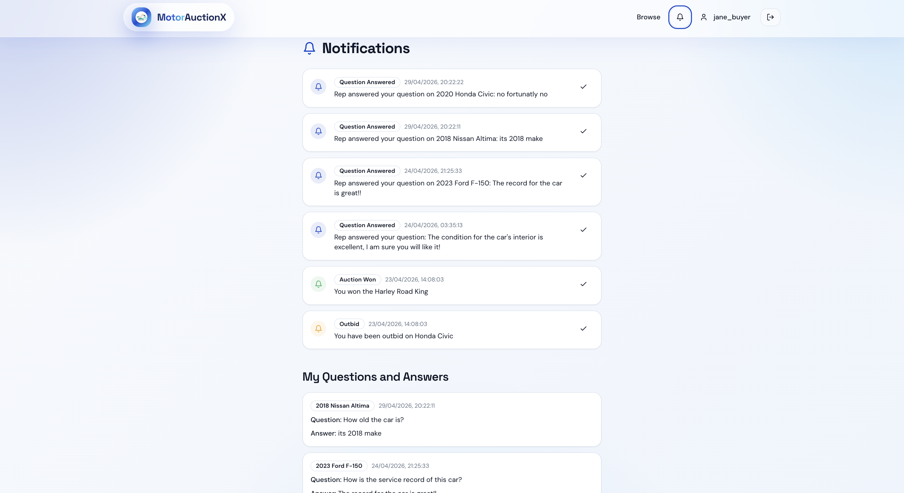
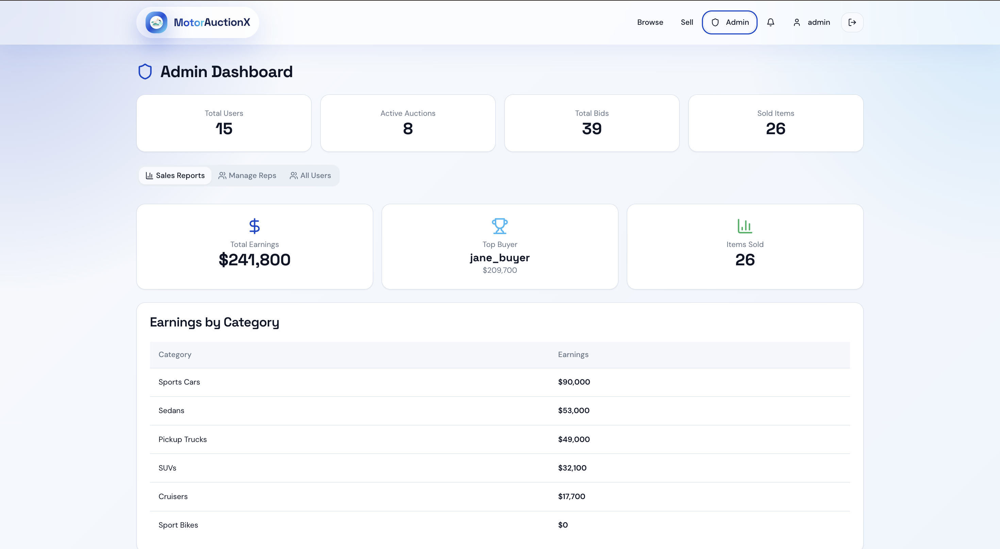
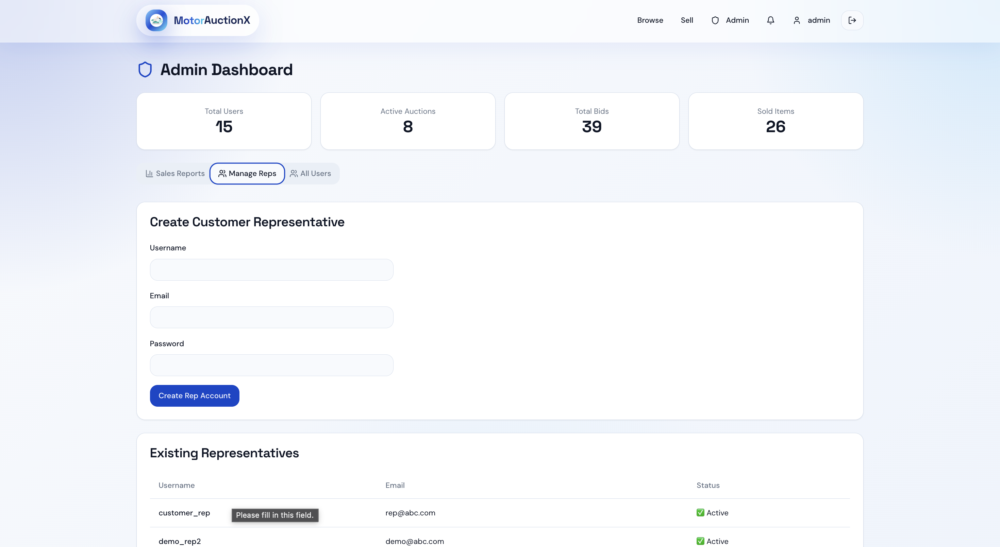
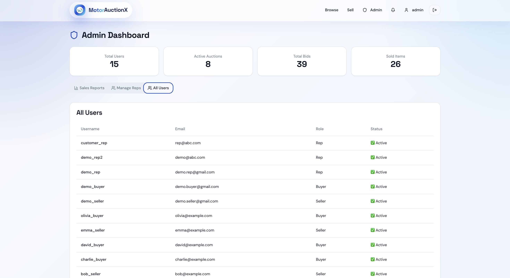

# MotorAuctionX

MotorAuctionX is a full-stack online auction platform built for vehicle and specialty item bidding. The project combines a Flask backend, a MySQL database, and a React frontend with a polished marketplace UI, seller workflows, buyer bidding, admin tools, notifications, and a Gemini-powered bidding assistant.

## What the app does

- AI assistant to find item and place bid
- Browse live and closed auctions
- View item details, bid history, and seller information
- Place manual bids with bid validation rules
- Configure auto-bid ceilings that react to competing bids
- Prevent consecutive bids from the same user
- Create new listings as a seller
- Use a natural-language bidding assistant on the home page
- Manage notifications and representative Q&A
- Access admin and rep panels for operational workflows

## Tech stack

- Frontend: React 18, TypeScript, Vite, Tailwind, Radix UI
- Backend: Flask, SQLAlchemy, PyMySQL
- Database: MySQL
- AI integration: Gemini API for intent extraction in the bidding assistant

## Repository structure

- `backend/`
  Main Flask API used by the frontend
- `frontend/`
  React + TypeScript client application
- `schema.sql`
  Base schema definition
- `buyme_full_dump.sql`
  Full schema and data snapshot for quick local setup
- `db_connector.py`
  Optional seeding utility API
- `project_images/`
  Project screenshots used in this README
- `app.py`
  Older tutorial-style Flask file, not the main application backend

## Screenshots

### Home page with Bid Assistant



### Browse auctions


### Item detail and bidding



### Notifications



### Admin views







## Prerequisites

- Python 3.10 or newer
- Node.js 18 or newer
- npm
- MySQL 8 or newer

## Local setup

### 1. Clone the repository

```bash
git clone <your-repo-url>
cd CS527_DBDS_Project_MotorAuctionX
```

### 2. Create the database

Import the provided dump into MySQL:

```bash
mysql -u root -p < buyme_full_dump.sql
```

The backend expects the database name to be `buyme`.

### 3. Set up the backend

Create and activate a virtual environment:

```bash
python3 -m venv venv
source venv/bin/activate
```

Install backend dependencies:

```bash
pip install -r backend/requirements.txt
pip install python-dotenv
```

### 4. Configure backend settings

Database connection values are currently defined directly in [backend/app.py](backend/app.py):

- `DB_USER`
- `DB_PASSWORD`
- `DB_HOST`
- `DB_PORT`
- `DB_NAME`

If you want to use the Gemini-powered bidding assistant, create a root `.env` file:

```env
GEMINI_API_KEY=your_gemini_api_key
GEMINI_MODEL=gemini-2.5-flash
```

### 5. Run the backend

```bash
cd backend
flask --app app run --port 5001
```

Backend base URL:

- `http://127.0.0.1:5001`

Expected health response:

```json
{"message":"BuyMe API is running"}
```

### 6. Run the frontend

Open a new terminal:

```bash
cd frontend
npm install
npm run dev
```

Frontend URL:

- `http://localhost:5173`

The Vite dev server proxies `/api` requests to:

- `http://localhost:5001`

## Gemini bidding assistant

The home page includes a natural-language bidding assistant. A user can type a request like:

```text
Place a bid on a sedan in my budget of 7000 dollars and not older than 2015
```

How it works:

1. The frontend sends the raw request to `/api/assistant/bid-plan`
2. Gemini extracts structured intent such as budget, year, and category
3. The backend matches that intent against live auctions
4. The best item is opened on the item page
5. The user can confirm the suggested bid with one click

The model is used for intent understanding only. The actual bid selection, validation, and bid amount logic remain controlled by backend rules.

## Bidding rules currently enforced

- Seller cannot bid on their own item
- Bid amount must meet the minimum increment
- Same user cannot place two consecutive bids
- Auto-bid responds to competing bids up to the configured ceiling
- Auctions must still be active and not expired

## Optional seed utility

If you want to use the auxiliary seeding server:

```bash
source venv/bin/activate
python db_connector.py
```

Then seed data:

```bash
curl -X POST http://127.0.0.1:5000/seed/all
```

## Recommended checks

### Frontend

```bash
cd frontend
npm run build
npm test
```

### Backend

Start the backend and verify key endpoints manually, especially:

- `/api/items`
- `/api/item/<id>`
- `/api/item/<id>/bids`
- `/api/assistant/bid-plan`

## Common issues

### Frontend cannot reach the API

Make sure the backend is running on port `5001`.

### MySQL connection fails

Verify the credentials hardcoded in `backend/app.py` and confirm the `buyme` database exists.

### Gemini assistant returns invalid API key

Make sure:

- `.env` exists at the repo root or in `backend/`
- `GEMINI_API_KEY` is valid
- the backend was restarted after updating the key

### Screenshots do not render on GitHub

Keep the README and `project_images/` folder together in the repository root so the relative image paths stay valid.

## Notes

- This repository appears to include both the active application backend in `backend/app.py` and an older tutorial file at the repo root named `app.py`
- The frontend branding and screenshots reflect the current UI iteration in this repository

## Course context

This project was developed in the context of CS 527 and is intended as an academic team project. Coordinate schema or API changes carefully if multiple contributors are working from the same database snapshot.
